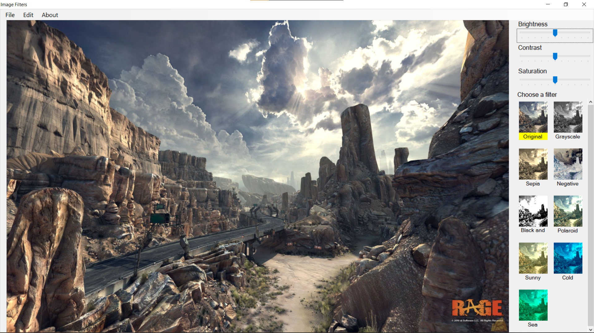
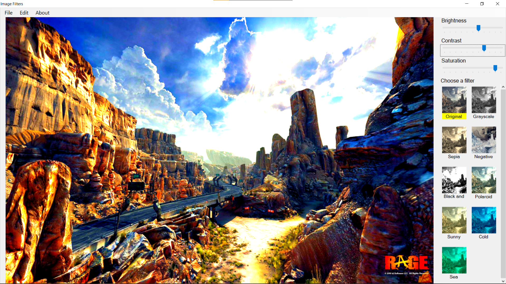

# Image Filter

## What it can
1) Change brightness, contrast, saturation
2) Apply some filters: Grayscale; Sepia; Polaroid; Sunny a.e

## Why I am doing this
Last month I was interested about Graphics algorighms. So I made this project to learn about color matrices. [Here](https://docs.rainmeter.net/tips/colormatrix-guide/) is color matrices I used

## Screenshots
<table>
 <tr>
  <td></td>
 </tr>
 <tr>
  <td></td>
 </tr>
</table>
